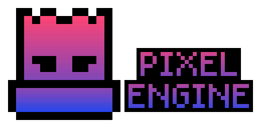

# Pixel Engine
 
Welcome to Pixel Engine!
 

  

 
## Overview
 
This project aims to create a specialized version of the Godot Engine that focuses exclusively on 2D game development by completely removing the 3D functionality from the source code. The goal is to provide a streamlined and optimized engine tailored specifically for 2D game development, while reducing the complexity and overhead associated with 3D rendering.

Join us in [supporting](https://godotengine.org/donate/) the official Godot Engine project, where numerous talented developers are working tirelessly to enhance the engine's capabilities. Together, we can contribute to the growth and success of the entire Godot community.

Check out the [Godot Engine repository](https://github.com/godotengine/godot) on GitHub and get involved in shaping the future of game development! Let's collaborate and make a lasting impact.

We believe that a specialized 2D-only version of the Godot Engine will empower developers to create amazing 2D games with optimal performance and ease. Join us in this exciting journey and let's revolutionize the world of 2D game development with the Godot Engine!

## Important note:

Please be aware that I am unable to guarantee the stability of the project or any Engine releases. It is highly recommended to use the Godot Engine or create a backup before importing your 4.x Godot project. Additionally, please note that this project was originally intended to be private, but due to limitations with GitHub actions, it had to be made public. Therefore, if you choose to use it, please understand that it is at your own responsibility and discretion.

## Project Goals

- Full Removal of 3D: The primary objective of this project is to remove all code, modules, and dependencies related to 3D rendering from the Godot Engine source code, resulting in a lightweight and efficient engine solely focused on 2D game development.

- Improved Performance: By eliminating the 3D subsystem, we aim to significantly enhance the performance of the engine for 2D games. This optimization will allow developers to create high-quality and performant 2D games without unnecessary overhead.

- Simplified Workflow: Removing the 3D functionality will streamline the engine's APIs, editor interface, and documentation to specifically cater to 2D game development. This will make it easier for developers to navigate and utilize the engine's features, resulting in a more intuitive and efficient workflow.

- Encouraging Contributions: We welcome contributions from developers interested in 2D game development. By focusing on a specific aspect of the engine, this project provides an opportunity for contributors to specialize and make meaningful contributions to the Godot community.

## Benefits of Using the 2D-Only Engine

- Performance: The engine's optimized architecture will ensure that your 2D games run smoothly and efficiently, maximizing performance on a wide range of devices.

- Simplicity: With the removal of 3D functionality, the engine will have a simpler and more focused API, making it easier to learn, use, and navigate for 2D game development.

- Improved Editor Experience: The editor will be streamlined specifically for 2D game development, providing a more intuitive interface with features and tools tailored to 2D game creation.

## Key Features
 
- **Customizability**: Godot 2D gives you the freedom to trim down features that you don't need, allowing you to create a lean and optimized game engine tailored to your specific game development requirements.
 
- **Efficiency**: By removing 3D features from the engine and editor, Godot 2D offers a lightweight and efficient development environment, enabling you to work seamlessly on 2D game projects without unnecessary distractions.
 
- **Flexibility**: As an open-source project, Godot 2D allows you to contribute to its development and collaborate with a passionate community of game developers. Together, we're shaping the future of game development by building a more customizable and accessible game engine.
 
## License
 
- This project is licensed under the MIT License. For more information, please refer to the [LICENSE](LICENSE.txt) file.

# Revolutionizing Rendering and Streamlined Source Code Structure

## Rendering Process Comparison: 2D vs 3D

| Step                     | 2D Rendering Process    | 3D Rendering Process    |
|--------------------------|-------------------------|-------------------------|
| Scene Setup              | ✔️                       | ✔️                       |
| Viewport Setup           | ✔️                       | ✔️                       |
| Camera Setup             | ✔️                       | ✔️                       |
| Transformations          | ✔️                       | ✔️                       |
| Visibility Checks        | ✔️                       | ✔️                       |
| Sorting                  | ✔️                       | ✔️                       |
| Batching                 | ✔️                       | ❌                       |
| Shader Application       | ✔️                       | ❌                       |
| Lighting and Shading     | ❌                       | ✔️                       |
| Shadow Mapping           | ❌                       | ✔️                       |
| Post-processing          | ❌                       | ✔️                       |
| Rendering                | ✔️                       | ✔️                       |
| Display                  | ✔️                       | ✔️                       |

### 2D Rendering Process:

1. **Scene Setup**: The 2D scene hierarchy is constructed by adding nodes such as sprites, textures, and other visual elements.
2. **Viewport Setup**: The viewport is configured to define the target area where the 2D scene will be rendered.
3. **Camera Setup**: A 2D camera, usually an orthographic camera, is set up to define the view and projection parameters for the scene.
4. **Transformations**: The positions, rotations, and scales of the 2D nodes are applied to transform the objects in the scene.
5. **Visibility Checks**: The renderer checks which objects in the scene are visible within the viewport and should be rendered.
6. **Sorting**: The visible objects are sorted based on their rendering order, which can be controlled by the layer and Z-index properties.
7. **Batching**: Similar objects with the same materials are batched together to optimize rendering performance.
8. **Shader Application**: Shaders, if applied to the objects, are executed to calculate the final color and visual effects.
9. **Rendering**: The final image is constructed by rasterizing the visible objects onto a 2D image buffer using pixel-based techniques.
10. **Post-processing**: Optional post-processing effects such as blur, color correction, or bloom can be applied to the rendered image.
11. **Display**: The resulting 2D image is displayed on the screen or within a texture for further usage.

### 3D Rendering Process:

1. **Scene Setup**: The 3D scene hierarchy is constructed by adding nodes such as meshes, lights, cameras, and other 3D objects.
2. **Viewport Setup**: The viewport is configured to define the target area where the 3D scene will be rendered.
3. **Camera Setup**: A 3D camera, typically a perspective camera, is set up to define the view and projection parameters for the scene.
4. **Transformations**: The positions, rotations, and scales of the 3D nodes are applied to transform the objects in the scene.
5. **Visibility Checks**: The renderer checks which objects in the scene are visible within the viewport and should be rendered.
6. **Culling**: Objects that are outside the frustum of the camera are culled (not rendered) to optimize performance.
7. **Sorting**: The visible objects are sorted based on their distance from the camera to ensure correct rendering order.
8. **Lighting and Shading**: Lighting calculations are performed to determine the interaction of light sources with the 3D objects. Shading models such as Phong or PBR can be used to calculate the final color and appearance of the objects.
9. **Shadow Mapping**: If enabled, shadows are calculated and applied to the scene to enhance realism.
10. **Post-processing**: Optional post-processing effects such as depth of field, motion blur, or ambient occlusion can be applied to the rendered image.
11. **Rendering**: The final image is constructed by rasterizing the visible 3D objects onto a 2D image buffer using techniques like z-buffering or ray tracing.
12. **Display**: The resulting 3D image is displayed on the screen or within a texture for further usage.

# Godot 4 Source Code Structure

The Godot game engine source code follows a modular structure that is organized into different directories and files. Here is an overview of the main directories in the Godot 4 source code:

- [core](core/) : Contains the core engine code, including the main engine loop, memory management, math utilities, and platform-specific code.

- [drivers](drivers/) : Contains platform-specific code and drivers, such as for input devices, graphics APIs, and audio systems.

- [editor](editor/) : Contains the code for the Godot editor, used for creating and editing game assets, scenes, and scripts.

- [main](main/) : Contains the entry point and core initialization code for the engine. It serves as the starting point of execution when running a Godot game or editor.

- [misc](misc/) : Contains miscellaneous files and resources that are not directly related to the core functionality of the engine. The contents of the "misc" folder may vary depending on the specific version and organization of the project.

- [modules](modules/) : Contains optional modules that can be added to Godot to extend its functionality, such as networking, AI, or scripting language support.

- [platform](platform/) : Contains platform-specific code and implementations for different operating systems and hardware platforms.

- [scene](scene/) : Contains the code related to the scene system, including the scene tree, nodes, and resources.

- [servers](servers/) : Contains various server implementations, such as the physics server, rendering server, audio server, and more.

- [tests](tests/) : Contains the automated tests for various parts of the Godot engine to ensure stability and correctness.

- [thirdparty](thirdparty/) : Contains third-party libraries used by Godot.

Please note that this is not an exhaustive list, and there may be additional directories depending on the specific version and configuration of Godot you are using.

# RenderingServer Class in Godot

The `RenderingServer` class in the Godot game engine is a crucial component responsible for handling the rendering of 2D and 3D graphics in a game or application.

Here are some key points about the `RenderingServer` class and its usage:

- The `RenderingServer` class provides a set of methods for managing the rendering pipeline, such as creating and manipulating visual resources, rendering meshes, applying materials, and controlling the rendering state.
- It serves as an interface between the engine's core and the platform-specific rendering APIs (e.g., OpenGL, Vulkan, DirectX) to abstract away the low-level details and provide a unified interface for rendering operations.
- The `RenderingServer` class is used to create and manage various types of visual resources, including meshes, materials, textures, shaders, and more.
- It provides methods for manipulating the viewports, which are responsible for rendering scenes onto the screen or offscreen surfaces.
- The `RenderingServer` class also offers functions for handling post-processing effects, such as applying shaders, performing screen-space reflections, and implementing other visual enhancements.
- In addition to rendering 3D graphics, the `RenderingServer` class also supports rendering 2D graphics. It provides methods for rendering sprites, particles, and other 2D elements efficiently.
- The `RenderingServer` class is typically used in conjunction with other classes, such as the `VisualServer` and `SceneManager`, to create and manage scenes, nodes, and resources.

Overall, the `RenderingServer` class plays a critical role in managing the rendering pipeline and provides a high-level API for performing various rendering operations in the Godot game engine.
